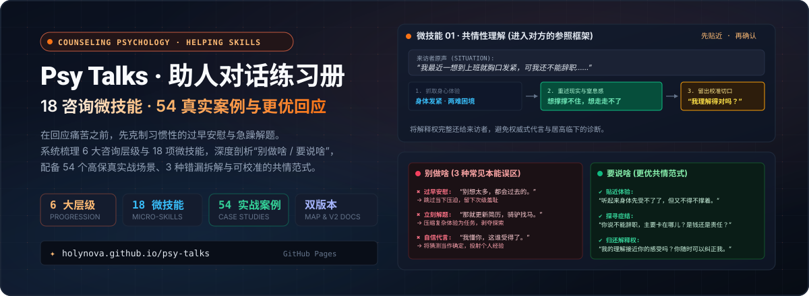

<p align="center">
  
</p>

<p align="center">
  <a href="https://holynova.github.io/psy-talks/"></a>
  <a href="https://react.dev/"></a>
  <a href="https://www.typescriptlang.org/"></a>
  <a href="https://vite.dev/"></a>
  <a href="#-十八项助人微技能全景索引-micro-skills-taxonomy"></a>
  <a href="#-五十四个真实案例与双向范式对照"></a>
  <a href="./LICENSE"></a>
</p>

---

## 💡 为什么我们需要刻意练习助人对话？(Value Proposition)

当亲友、伴侣或来访者袒露脆弱、焦虑或痛苦时，出于善意的本能反应往往会导致交流的灾难性关闭：
- **过早安慰**：*“别想太多，一切都会过去的”* —— 轻易抹杀对方当下真实的痛感，让倾诉者留下“我不该这么脆弱”的次级羞耻；
- **立刻解题**：*“那你就赶紧去更新简历，明天就去面试”* —— 粗暴地把复杂的心理困境压缩为事务性任务，剥夺当事人自主探索的契机；
- **自信代言 / 假性共情**：*“我完全懂你，换谁都受不了”* —— 用自己的主观猜测取代对对方独特生存体验的耐心倾听；
- **讲道理 / 道德教化**：*“你就是太内耗了，多去户外运动运动”* —— 居高临下的归因不仅无法解决问题，更瞬间斩断了人际连接的安全感；
- **贴标签 / 诊断化**：*“你这是回避型依恋 / 抑郁发作”* —— 用冷冰冰的术语将活生生的人客体化。

**《助人对话练习册》（Psy Talks / Helping Skills Dialogue Companion）** 立足经典人本主义助人技术（Clara E. Hill / Carl Rogers / Gerard Egan），将深奥的心理咨询微技能拆解为**可观察、可对比、可反复演练的认知脚手架**。

每一项技能均配备清晰的**“别做啥（Don't） / 要说啥（Do）”**高保真对照，帮助助人者在开口前踩下一脚刹车，真正学会**“把解释权还给对方，进入他人的参照框架”**。

---

## 🌐 在线体验与源码入口 (Live Demos)

| 体验通道 | 访问链接 | 适用场景说明 |
| :--- | :--- | :--- |
| 🚀 **GitHub Pages 在线练习册** | [holynova.github.io/psy-talks](https://holynova.github.io/psy-talks/) | 官方线上版本，支持手机与桌面浏览器 |
| 📖 **参考阅读版 (v2 文档视图)** | [holynova.github.io/psy-talks/v2](https://holynova.github.io/psy-talks/v2) | 经典书籍式编排，完整呈现 18 项技能深度解析 |
| 💻 **GitHub 源码仓库** | [github.com/holynova/psy-talks](https://github.com/holynova/psy-talks) | 完整 React 19 + TypeScript 源码与结构化文本 |

### 📱 手机扫码直达
扫描下方二维码，在手机端即可直接进入助人对话实训，随时随地抽取随机情境卡片：

<p align="center">
  
</p>

---

## 🖼 练习册实景交互 (Interface Showcase)

<p align="center">
  
</p>

- **双版本导航流转**：
  - **练习地图主控台 (`/`)**：结构化技能矩阵卡片，快速浏览 6 个层级与 18 个技巧的口诀与范例；
  - **参考阅读版 (`/v2`)**：左侧固定技能锚点导航，正文区域以“经典教材”排版完整展示红绿两列错误/更优回答对照。
- **随机闪卡场景练习 (`换一个场景`)**：一键生成真实情绪困境（如*“我觉得自己很失败，连休息都不敢”*、*“我不想生孩子，家里人说我自私”*），用于模拟即兴督导或自我提问练习。
- **沉浸式双主题**：支持米白典雅纸张浅色模式与护眼深色夜间模式自由切换。

---

## 🧭 六大递进层级 (The 6 Developmental Layers)

助人对话并非随意组合的聊天技巧，而是遵循由浅入深、层层递进的心理安全阶梯：

```
Level 06: [守住边界与安全] ─── 专业底线 · 伦理风险识别 · 危机干预与转介
           ▲
Level 05: [把领悟落到行动] ─── 由来访做主 · 意图澄清 · 微步行动 · 资源激活
           ▲
Level 04: [让模式浮出来]   ─── 从片段到理解 · 矛盾重述 · 模式识别 · 假设检验
           ▲
Level 03: [让情绪被看见]   ─── 命名而不盖章 · 情感反映 · 聚焦身心体验
           ▲
Level 02: [把模糊说清楚]   ─── 事实与体验还原 · 现象学非评判 · 还原现场细节
           ▲
Level 01: [先把关系站稳]   ─── 态度先于技巧 · 共情性理解 · 进入对方参照系
```

---

## 📚 十八项助人微技能全景索引 (Micro-Skills Taxonomy)

| 层级 | 编号 | 微技能名称 | 核心口诀 (Mnemonic) | 核心动作 (Core Move) | 警惕陷阱 (Watch Out) |
| :--- | :---: | :--- | :--- | :--- | :--- |
| **01 稳住关系** | `01` | **共情性理解** | 先贴近，再确认 | 先重述身心体验，再留校准切口：“我理解得接近吗？” | 绝不说“我完全懂你”，不替对方下定论 |
| | `02` | **现象学非评判** | 描述现象，悬置假设 | 只陈述听到的原话与观察到的停顿，不加价值判定 | 避免在语气中透露“你应该/你不该”的道德训诫 |
| **02 澄清事实** | `03` | **具体化** | 问细节，还原现场 | “当时具体发生了什么？对方说了哪句话让你最难受？” | 避免宏观抽象讨论（如“人生就是很累”），拉回具体场景 |
| | `04` | **澄清认知** | 区分事实与解释 | 协助厘清“实际发生的事”与“大脑对这件事的灾难化解读” | 不直接反驳其信念，而是引导其觉察两者的缝隙 |
| | `05` | **意图澄清** | 确认此刻诉求 | “你现在跟我分享这些，最希望我怎样陪伴你？是听听还是出招？” | 不盲目默认对方需要方案，尊重倾诉本身的治愈力 |
| **03 觉察情绪** | `06` | **情感反映** | 捕捉情绪，命名体验 | 捕捉话语底层的情绪词汇：“听起来除了委屈，还有深深的无力。” | 情绪词应作为试探性命名，允许对方修正 |
| | `07` | **聚焦感受** | 连结身心，倾听身体 | “当你提到那件事时，你身体哪里感觉最明显？喉咙、胸口还是胃部？” | 避免过度理性智巧化逃避，引导体验在身体的留存 |
| | `08` | **即时化** | 关注当下，觉察场域 | 敏锐关注咨询室或对话此刻的微表情、沉默与人际张力 | 需在关系稳固后使用，不带有攻击性质问 |
| **04 浮现模式** | `09` | **意义探索** | 挖掘底层核心价值 | “这件事之所以让你这么痛苦，是因为它触碰了你最看重的什么？” | 痛苦往往是价值观的倒影，帮助对方看见内在执着 |
| | `10` | **矛盾重述** | 照见冲突，托举张力 | “你一边渴望独立生活，一边又深深担心让父母失望……” | 并置矛盾两端，不偏袒任何一方，容纳复杂性 |
| | `11` | **模式识别** | 串联过往，识别脚本 | “在之前的关系中，每当遇到类似情况，你是不是也会习惯性退缩？” | 呈现行为闭环，而非评判性格缺陷 |
| | `12` | **假设检验** | 邀请验证，保持开放 | “我们不妨一起看看：如果不这么做，最糟糕的结果一定会发生吗？” | 保持科学探究态度，陪伴对方搜集现实证据 |
| | `13` | **寻找例外** | 发现韧性，打破全黑 | “过去有没有哪一次，尽管处境同样艰难，但你依然撑过来了？” | 撬动全有全无思维，唤醒曾经被遗忘的自愈经验 |
| **05 行动赋能** | `14` | **微步行动** | 最小阻力，自主迈出 | “如果明天只做一件最微小的事，哪怕只要 3 分钟，你愿意试什么？” | 不替来访制定宏伟计划，聚焦阻力最小的启动步枪 |
| | `15` | **资源激活** | 盘点支点，重获力量 | 梳理身边可依赖的人际资源、物质支持与内心力量储备 | 避免在当事人深陷绝望时空洞打气，从实际支点切入 |
| **06 守住底线** | `16` | **边界设立** | 温和坚定，厘清权责 | 明确界定助人者的角色局限，不扮演全能拯救者 | 拒绝代行当事人的生活决定，拒绝情感剥削与缠绕 |
| | `17` | **伦理风险识别**| 警惕双重关系与偏见 | 识别价值强加、利益冲突、个人反移情投射及保密边界 | 保持专业中立，及时寻求同行督导支持 |
| | `18` | **危机转介** | 守住生命红线，果断介入 | 识别自伤、自杀或伤害他人意念，打破保密原则启动安全网络 | 严禁单打独斗，第一时间转介至精神科或心理危机干预热线 |

---

## 🎯 五十四个真实案例与双向范式对照 (Case Studies Architecture)

本项目为全网独创性地构建了 **54 个覆盖职场倦怠、亲子冲突、亲密关系破裂、自我怀疑、生死哀伤与人际边界** 的真实情境剧场。

每个案例均由四个不可或缺的教学构件组成：
1. **真实原声 (Situation)**：还原倾诉者带着情绪颗粒度的原话；
2. **典型错漏 (3 Wrong Responses)**：标注具体心理陷阱（如“过早安慰”、“立刻解题”、“自信代言”），列出常见踩坑回答，并深入解析**为什么这样说会造成二次伤害**；
3. **更优范式 (3 Better Responses)**：提供具备可校准切口（“我理解得接近吗？”、“你愿意多跟我讲讲吗？”）的人本主义更优表达；
4. **督导精要 (Pedagogical Note)**：提炼该情境背后的人格动力学与助人核心要点。

---

## 🛠 开发与构建指南 (Development & Build)

### 1. 本地开发环境启动
```bash
# 安装依赖 (Node.js >= 22.13.0)
npm install

# 启动 Vite 本地开发服务器 (访问 http://localhost:5173)
npm run dev

# 启动本地生产预览
npm run start
```

### 2. 自动化构建与 GitHub Pages 部署
```bash
# 执行类型检查与生产静态打包
npm run build

# 打包适用于 GitHub Pages 的静态站点 (输出至 docs/ 目录并生成 .nojekyll)
npm run build:pages
```

### 3. 执行自动化 HTML 渲染验证测试
```bash
npm test
```
> 自动完成生产构建并运行 `node --test tests/rendered-html.test.mjs`，严密校验页面挂载、SEO 标签与核心交互渲染完整性。

---

## 📄 许可协议与免责声明 (License & Disclaimer)

本项目基于 [MIT License](./LICENSE) 开源。

> **免责声明**：本项目内容属于心理学助人技术与对话沟通技巧的教学与自我训练参考，**不构成也不可替代专业心理咨询、临床心理治疗或精神科医学诊断**。如遇紧急心理危机、自伤自残或重度抑郁发作，请立即向当地医院精神心理科就诊，或拨打全国心理危机干预热线（中国大陆：`400-161-9995` / `010-82951332`）。
